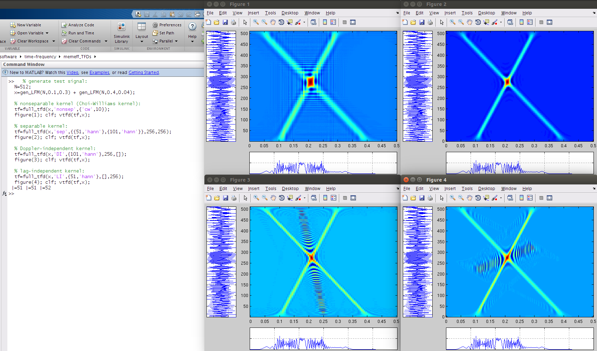
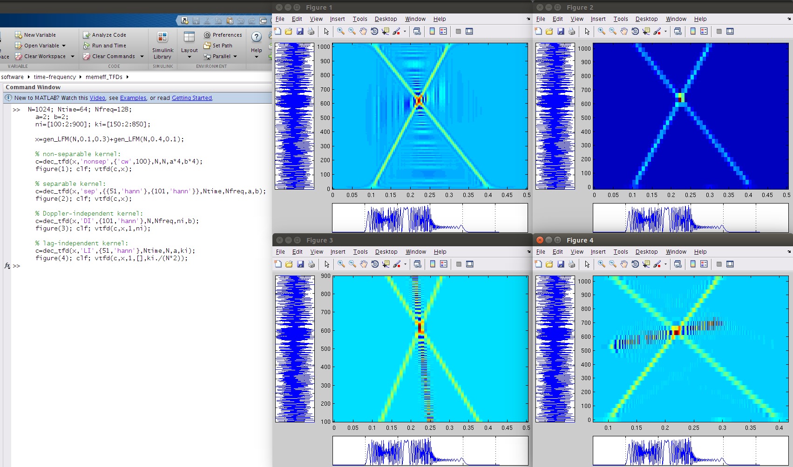

# Fast and Memory-Efficient Algorithms for Quadratic Time–Frequency Distributions

A collection of M-files to compute time–frequency distributions from the quadratic class [[1]](#references). Memory and computational load is limited by controlling the level of over-sampling for the TFD. Oversampling in the TFD is proportional to signal length and bandwidth of the Doppler–lag kernel. Algorithms are optimised to four kernel types: nonseparable, separable, lag-independent, and Doppler-independent kernels.  

Also included are algorithms to compute decimated, or sub-sampled, TFDs. Again, these
algorithms are specific to the four kernel types but compute approximate TFDs by a process
of decimatation.  

Requires Matlab or Octave (programming environments).  

Latest version available at [memeff_TFDs homepage](http://otoolej.github.io/code/memeff_TFDs/).


# Contents
- [quick start](#quick-start)
- [description](#description)
- [files](#files)
- [computational load](#computational-load)
- [requirements](#requirements)
- [test computer setup](#test-computer-setup)
- [licence](#licence)
- [references](#references)
- [contact](#contact)


# quick start
First, add paths using the `load_curdir` function:
```matlab
  >> load_curdir;
```

# description

There are two sets of TFD algorithms: one set computes oversampled TFDs and the other
set computes decimated (sub-sampled or undersampled) TFDs. The first set, for computing
oversampled TFDs, has four algorithms for specific kernel types, namely the
- non-separable kernel,
- separable kernel,
- Doppler-independent (DI) kernel,
- and lag-independent (LI) kernel.

The function to generate these oversampled TFDs is `full_tfd.m`. The following
examples, using a test signal, illustrates usage:

```matlab
  % generate test signal:
  N=512;
  x=gen_LFM(N,0.1,0.3) + gen_LFM(N,0.4,0.04);

  % nonseparable kernel (Choi-Williams kernel):
  tf=full_tfd(x,'nonsep',{'cw',10});
  figure(1); clf; vtfd(tf,x);
  
  % separable kernel:
  tf=full_tfd(x,'sep',{{51,'hann'},{101,'hann'}},256,256);
  figure(2); clf; vtfd(tf,x);
  
  % Doppler-independent kernel:
  tf=full_tfd(x,'DI',{101,'hann'},256,[]);
  figure(3); clf; vtfd(tf,x);
  
  % lag-independent kernel:
  tf=full_tfd(x,'LI',{51,'hann'},[],256);
  figure(4); clf; vtfd(tf,x);
```

Type `help full_tfd` for more details.

Likewise, the algorithms for decimated TFDs are specific to the four kernel types. The
function `dec_tfd` computes the decimated TFDs, as the following examples show:

```matlab
  N=1024; Ntime=64; Nfreq=128;                                              
  a=2; b=2;                                                       
  ni=[100:2:900]; ki=[150:2:850];                                 
                                                                  
  x=gen_LFM(N,0.1,0.3)+gen_LFM(N,0.4,0.1);                        
                                                                  
  % non-separable kernel:                                         
  c=dec_tfd(x,'nonsep',{'cw',100},N,N,a*4,b*4);                       
  figure(1); clf; vtfd(c,x);                                      
                                                                  
  % separable kernel:                                             
  c=dec_tfd(x,'sep',{{51,'hann'},{101,'hann'}},Ntime,Nfreq,a,b);    
  figure(2); clf; vtfd(c,x);                                      
                                                                  
  % Doppler-independent kernel:                                   
  c=dec_tfd(x,'DI',{101,'hann'},N,Nfreq,ni,b);                      
  figure(3); clf; vtfd(c,x,1,ni);                                 
                                                                  
  % lag-independent kernel:                                       
  c=dec_tfd(x,'LI',{51,'hann'},Ntime,N,a,ki);                       
  figure(4); clf; vtfd(c,x,1,[],ki./(N*2));                       
```


Type `help dec_tfd` for more details on this function.


# files
All Matlab files (.m files) have a description and an example in the header. To read this
header, type `help <filename.m>` in Matlab.  Directory structure is as follows: 
```
├── common             # directory: files to generate kernel functions
├── decimated_TFDs     # directory: files to generate decimated TFD for the 4 kernel types
├── dec_tfd.m          # file: compute decimated TFDs
├── full_tfd.m         # file: compute oversampled TFDs
├── full_TFDs          # directory: files to generate oversampled TFD for the 4 kernel types
├── LICENCE.md         # file: licence file
├── load_curdir.m      # file: adds paths for matlab/octave
├── README.md          # file: this README file
└── utils              # directory: miscellaneous files
```


# computational load

The computational load is measured in terms of the number of FFTs required to compute the
TFD. Memory load is measured as the total memory required to compute and store the
TFD. The real-valued signal (i.e. input signal) is of length N.

Computational load for the oversampled TFDs (using `full_tfd.m`) is as follows for the
four kernel types:

| kernel-type   | computational load           | memory (real-valued points) |
|---------------|------------------------------|-----------------------------|
| non-separable | 3N²/2 log₂ N                 | N²                          |
| LI            | NNtime/2 log₂ Ntime          | Ntime × N                   |
| DI            | NNfreq/2 log₂ Nfreq          | N × Nfreq                   |
| separable     | Pₕ(N log₂N +Ntime log₂Ntime) | Ntime × Nfreq               |
|               | + NtimeNfreq/2 log₂ Nfreq    |                             |

assuming the FFT of length-N signal requires Nlog₂N computations and using the notation:

| symbol | explanation                                                 |
|--------|-------------------------------------------------------------|
| N      | length of signal                                            |
| Ntime  | length of TFD in time direction                             |
| Nfreq  | length of TFD in frequency direction                        |
| Pₕ     | Pₕ = P/2, where P is the length of the lag window           |

And for the decimated TFDs (using `dec_tfd.m`):

| kernel-type   | computational load           | memory (real-valued points) | grid     |
|---------------|------------------------------|-----------------------------|----------|
| non-separable | N²/2 log₂ N + LJ/2 log₂ J    | L × J                       | ρ[an,bn] |
| LI            | VLtime/2 log₂ Ltime          | Ltime × V                   | ρ[an,kᵢ] |
| DI            | UJfreq/2 log₂ Jfreq          | U × Jfreq                   | ρ[nᵢ,bk] |
| separable     | JfreqN/2 log₂N               | Ltime × Jfreq               | ρ[an,bn] |
|               | + LtimeJfreq log₂ LtimeJfreq |                             |          |
   
using the extra notation:

| symbol | explanation                                                 |
|--------|-------------------------------------------------------------|
| U      | length of sequence nᵢ {nᵢ for 1<=i<=U}, U<=N and 0<=nᵢ<=N-1   |
| V      | length of sequence kᵢ {kᵢ for 1<=i<=V}, V<=N and 0<=kᵢ<=N-1   |
| J      | N/b, b is decimation integer in frequency direction         |
| L      | N/a, a is decimation integer in time direction              |
| Jfreq  | Nfreq/b, b is decimation integer in frequency direction     |
| Ltime  | Ntime/a, a is decimation integer in time direction          |


# requirements
Either Matlab (R2012 or newer,
[Mathworks website](http://www.mathworks.co.uk/products/matlab/)) or Octave (v3.6 or
newer, [Octave website](http://www.gnu.org/software/octave/index.html), with the
'octave-signal' add-on package).  


# test computer setup
- hardware:  Intel(R) Xeon(R) CPU E5-1603 0 @ 2.80GHz; 8GB memory.
- operating system: Ubuntu GNU/Linux x86_64 distribution (Trusty Tahr, 14.04), with Linux kernel 3.13.0-27-generic
- software: Octave 3.8.1 (using Gnuplot 4.6 patchlevel 4), with 'octave-signal' toolbox and Matlab (R2009b, R2012a, and R2013a)

---

# licence

```
Copyright (c) 2014, John M. O' Toole, University College Cork
All rights reserved.

Redistribution and use in source and binary forms, with or without modification,
are permitted provided that the following conditions are met:

  Redistributions of source code must retain the above copyright notice, this
  list of conditions and the following disclaimer.

  Redistributions in binary form must reproduce the above copyright notice, this
  list of conditions and the following disclaimer in the documentation and/or
  other materials provided with the distribution.

  Neither the name of the University College Cork nor the names of its
  contributors may be used to endorse or promote products derived from
  this software without specific prior written permission.

THIS SOFTWARE IS PROVIDED BY THE COPYRIGHT HOLDERS AND CONTRIBUTORS "AS IS" AND
ANY EXPRESS OR IMPLIED WARRANTIES, INCLUDING, BUT NOT LIMITED TO, THE IMPLIED
WARRANTIES OF MERCHANTABILITY AND FITNESS FOR A PARTICULAR PURPOSE ARE
DISCLAIMED. IN NO EVENT SHALL THE COPYRIGHT HOLDER OR CONTRIBUTORS BE LIABLE FOR
ANY DIRECT, INDIRECT, INCIDENTAL, SPECIAL, EXEMPLARY, OR CONSEQUENTIAL DAMAGES
(INCLUDING, BUT NOT LIMITED TO, PROCUREMENT OF SUBSTITUTE GOODS OR SERVICES;
LOSS OF USE, DATA, OR PROFITS; OR BUSINESS INTERRUPTION) HOWEVER CAUSED AND ON
ANY THEORY OF LIABILITY, WHETHER IN CONTRACT, STRICT LIABILITY, OR TORT
(INCLUDING NEGLIGENCE OR OTHERWISE) ARISING IN ANY WAY OUT OF THE USE OF THIS
SOFTWARE, EVEN IF ADVISED OF THE POSSIBILITY OF SUCH DAMAGE.
```


# references

1. J.M. O' Toole and B. Boashash, “Memory Efficient Algorithms for TFDs”, Article 6.6, Chapter 6, in Time–Frequency Signal Processing and Analysis: A Comprenhensive Reference, Second Edition, 2014, in press.

2. J.M. O' Toole and B. Boashash, "Fast and memory-efficient algorithms for computing quadratic time–frequency distributions", Applied and Computational Harmonic Analysis, vol. 35, no. 2, pp. 350–358, 2013.

3. J.M. Oʼ Toole, M. Mesbah, and B. Boashash, “Improved discrete definition of quadratic time–frequency distributions,” IEEE Transactions on Signal Processing, vol. 58, Feb. 2010, pp. 906-911.

4. J.M. O' Toole, M. Mesbah, and B. Boashash, "A New Discrete Analytic Signal for Reducing Aliasing in the Discrete Wigner-Ville Distribution", IEEE Transactions on Signal Processing, vol. 56, no. 11, pp. 5427-5434, Nov. 2008.

5. J.M. Oʼ Toole, M. Mesbah, and B. Boashash, “Algorithms for discrete quadratic time–frequency distributions,” WSEAS Transactions on Signal Processing, vol. 4, May. 2008, pp. 320-329.


---

# contact

John M. O' Toole

Neonatal Brain Research Group,  
Irish Centre for Fetal and Neonatal Translational Research (INFANT),  
Department of Paediatrics and Child Health,  
University College Cork,  
Western Gateway Building, Room 2.17,  
Cork, Ireland

- email: j.otoole <AT> ieee.org
- web: http://otoolej.github.io/
